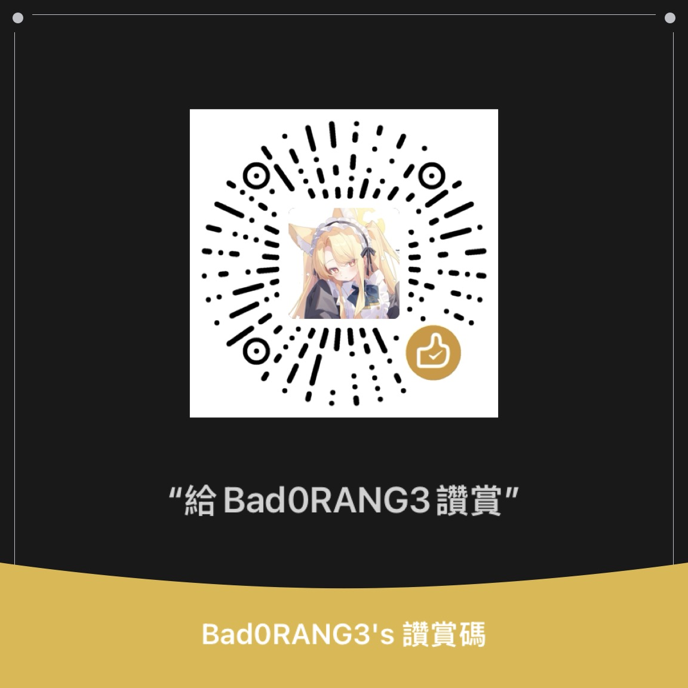

<div align="center">

<h1>
  
</h1>

</div>

---

## 🎯 个人信息

| 🎂 生日 | 📍 位置 | 💼 职业 | 🎓 状态 |
|---------|---------|---------|---------|
| 2008-03-03 | 广东 河源 | 在校学生 | 学习中 |

---

## 🌐 社交媒体

[](https://github.com/Bad0RANG3)
[](https://x.com/Bad0RANG3)
[](https://instagram.com/Bad0RANG3ovo)
[](https://www.douyin.com/user/MS4wLjABAAAA3y9usLYBic-19MR78rfDbN-VmS3RhnVMmlZMmnt39m8)
[](mailto:badorangeovo@outlook.com)
[](https://t.me/Bad0RANG3)
[](https://youtube.com/@Bad0RANG3)
[](https://space.bilibili.com/482966540)

---

## 💻 技术栈


---

## 🎮 游戏与娱乐

[](https://osu.ppy.sh/users/38542824)
[](https://namemc.com/profile/Bad0RANG3)
[](https://settings.gg/Bad0RANG3)
[](https://steamcommunity.com/id/Bad0RANG3)
[](https://music.163.com/#/user/home?id=1864136351)

街机：舞萌(16003) · 舞立方(2098)  都是代的（

---

## 👤 个人档案

| 🎭 性格 | 🎮 游戏 | 🌙 作息 | 💪 抗压 |
|---------|---------|---------|---------|
| ISFP-T | 枪软身法还行 | 作息颠倒 | 吃压力，放心骂 |

---

## 💭 心情状态

```cpp
#include <iostream>
int main() {
    while (true) {
        std::cout << "我喜欢你" << std::endl;
    }
    return 0;
}
```

---

## 🌈 个人宣言

> "四大皆空😡😡（指钱包、微信、支付宝和VISA）"
> 
> "欢迎和我交朋友^-^"
> 
> "愿意和我组一辈子乐队吗？"
---

## 📝 名言

> "rm -rf /"
> 
> "质疑屎山，理解屎山，制造屎山"

---

<div align="center">

## 🤝 支持我

如果你喜欢我的项目，请给它们一个 ⭐️！



<h3>
  
</h3>


</div>
